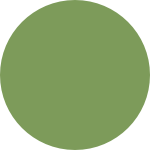

# Flat Game

Flat Game is a tiny game library that has some basic functionality to handle rendering or keyboard input. It was made for learning purposes so it is lacking a lot of obvious features, like audio support or animations. Also it probably has many compatibility issues.

# Next steps
- Spritesheets
- Audio support
- Improve way of triggering changes in parent from child entities
- Improve font construction to avoid duplicate work when using different scales for same font
- More collision shapes

# How to use

This guide will explain how to use the library. Since it is very small and simple, the usage is also very straightforward. The example will have a simple circle that can be moved using arrow keys.

To start you should get this library and set some general configurations in a file name `config.json`:
```json
{
  "name": "My Game",
  "graphics": "opengl",
  "bg_color": {
    "x": 1,
    "y": 1,
    "z": 1
  },
  "max_fps": 60,
  "size": {
    "x": 800,
    "y": 600
  }
}
```

The fields should be self-explanatory. Currently, `flat_game` supports only opengl.

Now, create a file called `main.go` and add this snipper:
```go
package main

import (
	"runtime"

	"github.com/paulotokimatu/flat_game"
	"github.com/paulotokimatu/flat_game/game"
)

func main() {
	runtime.LockOSThread()

	config := flat_game.NewConfigFromJson("config.json")

	myGame := game.NewGame(config)

	myGame.Run()
}
```

Basically we are adding the necessary dependencies, loading the config file and starting the game object. Because of OpenGL, `runtime.LockOSThread()` is required.

If we run `go run main.go` we should see an empty window. This is what we are expecting right now.

Let's add the circle now. This requires us to understand the main actors of `flat_game`, which are _entities_. In few words, entities are objects that do something on each game tick. They can have children and can be used to create a game character, a sprite, movement logic or many other things.

Our circle will need a texture. Download the follow image and add it to your working folder:



To use the texture in the game we must load it first:
```go
circleTexture, err := myGame.AddTexture("circle", "circle.png")
if err != nil {
  panic(err)
}
```

Next it is time to create an entity to use the texture. `flat_game` comes with a built-in entity for that, so let´s use it:
```go
import "github.com/paulotokimatu/flat_game/entity"

spriteEnt := entity.NewSpriteEnt(&entity.Config{Name: "sprite"}, circleTexture, true)
```

The first argument is just an entity configuration object, you may pass the name, position and size of the entity. In case of a sprite we don't need position or size since we can use the data from the sprite's parent entity, as flagged in the third argument. The second argument is the texture object.

To make everything work now, we need to create more two entity:
- The base circle entity which will hold `sprintEnt`
- A _scene_, which is basically a special entity that can hold collisions and key event listeners. It should be the entry point entity for the main game object. You may have multiple scenes to different game levels, menus or screens.

```go
import "github.com/paulotokimatu/flat_game/utils"

circleEnt := entity.NewBaseEntity(&entity.Config{
  Name:     "circle",
  Position: utils.Vec2{X: 100, Y: 100},
  Size:     utils.Vec2{X: 150, Y: 150},
})
circleEnt.AddChild(spriteEnt)

mainScene := entity.NewScene(&entity.Config{Name: "level"})
mainScene.AddChild(circleEnt)

myGame.SetScene(mainScene, false)
```

Now start the game again and you should be seeing a green circle.

To finish, we can add movement to the circle. To accomplish that we can create a custom entity:

```go
import "github.com/paulotokimatu/flat_game/input"

type MovementEnt struct {
	flat_game.IEntity
}

func NewMovementEnt(config *entity.Config) *MovementEnt {
	entity := entity.NewBaseEntity(config)

	return &MovementEnt{
		IEntity: entity,
	}
}

func (ent *MovementEnt) Tick(game flat_game.IGame, parent flat_game.IEntity, delta float32) {
	graphics := game.Graphics()

	newPosition := parent.Position()

	if graphics.IsKeyPressed(input.KeyUp) {
		newPosition.Y -= 100 * delta
	}
	if graphics.IsKeyPressed(input.KeyRight) {
		newPosition.X += 100 * delta
	}
	if graphics.IsKeyPressed(input.KeyDown) {
		newPosition.Y += 100 * delta
	}
	if graphics.IsKeyPressed(input.KeyLeft) {
		newPosition.X -= 100 * delta
	}

	parent.SetPosition(newPosition)
}
```

`MovementEnt` is embedding the built-in `BaseEntity` and exposing a specific _Tick_ method. This method basically checks if any of the arrow keys is being pressed, and if true, update the position of its parent entity. Let's now instantiate this entity and add it as a child of `circleEnt`

```go
movementEnt := NewMovementEnt(&entity.Config{Name: "movement"})

circleEnt.AddChild(movementEnt)
```

Finally, you have a circle that can move through the window! In case anything is confusing in the steps above, you can see the full example here:

```go
package main

import (
	"runtime"

	"github.com/paulotokimatu/flat_game"
	"github.com/paulotokimatu/flat_game/entity"
	"github.com/paulotokimatu/flat_game/game"
	"github.com/paulotokimatu/flat_game/input"
	"github.com/paulotokimatu/flat_game/utils"
)

func main() {
	runtime.LockOSThread()

	config := flat_game.NewConfigFromJson("config.json")

	myGame := game.NewGame(config)
	prepareGame(myGame)

	myGame.Run()
}

func prepareGame(myGame flat_game.IGame) {
	circleTexture, err := myGame.AddTexture("circle", "circle.png")
	if err != nil {
		panic(err)
	}

	spriteEnt := entity.NewSpriteEnt(&entity.Config{Name: "sprite"}, circleTexture, true)

	movementEnt := NewMovementEnt(&entity.Config{Name: "movement"})

	circleEnt := entity.NewBaseEntity(&entity.Config{
		Name:     "circle",
		Position: utils.Vec2{X: 100, Y: 100},
		Size:     utils.Vec2{X: 150, Y: 150},
	})
	circleEnt.AddChild(spriteEnt)
	circleEnt.AddChild(movementEnt)

	mainScene := entity.NewScene(&entity.Config{Name: "level"})
	mainScene.AddChild(circleEnt)

	myGame.SetScene(mainScene, false)
}

type MovementEnt struct {
	flat_game.IEntity
}

func NewMovementEnt(config *entity.Config) *MovementEnt {
	entity := entity.NewBaseEntity(config)

	return &MovementEnt{
		IEntity: entity,
	}
}

func (ent *MovementEnt) Tick(game flat_game.IGame, parent flat_game.IEntity, delta float32) {
	graphics := game.Graphics()

	newPosition := parent.Position()

	if graphics.IsKeyPressed(input.KeyUp) {
		newPosition.Y -= 100 * delta
	}
	if graphics.IsKeyPressed(input.KeyRight) {
		newPosition.X += 100 * delta
	}
	if graphics.IsKeyPressed(input.KeyDown) {
		newPosition.Y += 100 * delta
	}
	if graphics.IsKeyPressed(input.KeyLeft) {
		newPosition.X -= 100 * delta
	}

	parent.SetPosition(newPosition)
}
```

# Other examples

A more complete sample of usage can be found [here](https://github.com/paulotokimatu/flying_square), in this very basic clone of Flappy Birds.

# Acknowledgements

Much of the code related to OpenGL was based on:
https://learnopengl.com/
